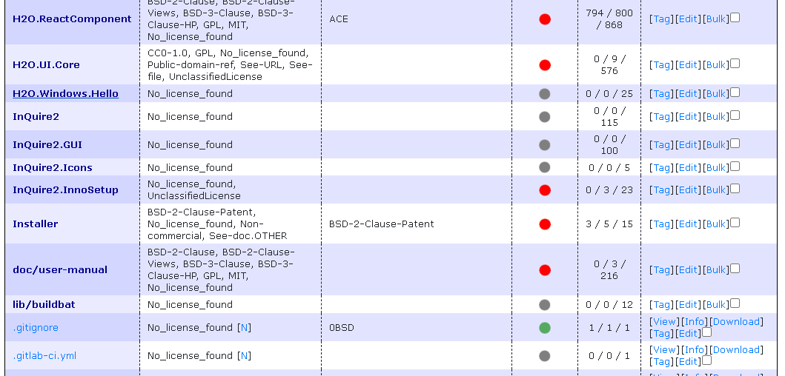
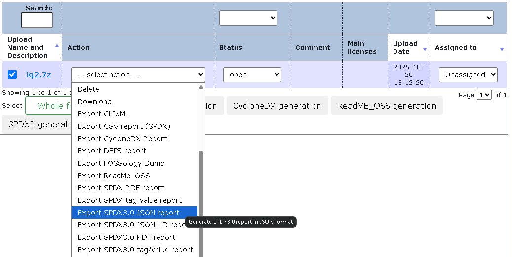

# FOSSology 基礎入門

FOSSology 是一個開源授權合規軟體系統與工具包，用於執行授權、版權和出口管制掃描，提供資料庫和網頁使用者介面 (Web UI) 來實現合規工作流程。

## 1. FOSSology 系統安裝

FOSSology 的後端使用 **PostgreSQL** 作為資料庫伺服器，並需要 **Apache httpd 2.6** 作為網頁伺服器。開發堆疊主要使用 C、C++ 和 PHP。

### 方式一：使用 Docker Compose (推薦)

此方法可確保資料持久性，並定義了多個容器服務（`scheduler`、`web` 和 `db`）。

1.  **啟動服務：** 使用 `docker-compose up` 指令啟動所有三個服務。
2.  **存取與登入：**
    *   開啟瀏覽器，存取網址：`http://IP_OF_DOCKER_HOST:8081/repo`。
    *   使用預設帳號密碼登入：
        *   **使用者名稱 (Username):** `fossy`
        *   **密碼 (Password):** `fossy`

### 方式二：快速單一容器安裝

此方法不管理資料持久性，不建議用於生產環境。

1.  **執行 Docker 容器：**
    ```bash
    docker run -p 8081:80 fossology/fossology
    ```
2.  **存取與登入：** 登入資訊與上述相同。

## 2. 上傳準備掃描的原始碼

登入 FOSSology 後，可以透過多種方法上傳檔案（例如從伺服器、URL 或 Git 伺服器）。

1.  **導航至上傳頁面：** 點擊選單中的 **Upload**。  
  
2.  **選擇檔案：** 選擇最簡單的方式 **Upload from file**，然後選擇要掃描的壓縮檔 (例如：tarball 或 zip 檔案)。
3.  選擇想要使用的分析方法。

<div style="page-break-after: always;"></div>

## 3. 上傳頁面中的每個分析選項的意義

FOSSology 會先解包上傳的軟體包，然後對每個文件運行多個分析代理 (Agents)。

| 區域/選項 | 意義與功能 | 支援來源 |
| :--- | :--- | :--- |
| **Nomos License Analysis** | **授權掃描核心：** 採用**基於規則**（rule-based）的正則表達式和語意關聯偵測授權，即使只找到一個關鍵字也會報告。 | |
| **Monk License Analysis** | **授權掃描：** 採用**文字比對法**，透過與資料庫中的原始授權文本比對相似度來確認。 | |
| **Ojo License Analysis** | **授權掃描：** 專門掃描 **SPDX 授權識別符**，速度快且能理解 `WITH`、`AND` 或 `OR` 等連詞。 | |
| **Copyright Analysis** | **版權掃描：** 掃描文件中的版權聲明，具有非常低的誤報率（false negative finding）。 | |
| **ECC Analysis** | **出口管制分析：** 專門尋找與**加密 (Crypto)** 或**出口管制 (Export Control)** 相關的字樣。 | |
| **Keyword Analysis** | **關鍵字掃描：** 可檢查使用者自定義的敏感詞或公司名稱。 | |
| **Package Analysis** | **套件分析：** 偵測檔案中包含的所有第三方套件與元件。 | |
| **ScanCode Toolkit** | 整合外部工具，用於掃描授權、版權、電子郵件和 URL，使用者可比較兩種工具的結果。 | |
| **Automatic Concluded License Deciding** | 允許 FOSSology 自動確認最終授權決策。 | |
| **Reuse** | 重複利用既有的分析結果和人工審查決策，只重新掃描有變更的檔案，有助於節省大量時間。 | |

<div style="page-break-after: always;"></div>

## 4. 工作排程中每個工作名稱的名詞解釋


當檔案上傳後，系統會分配一個或多個工作（Job）。這些工作由排程器（Scheduler）服務處理。

| 工作階段/名稱 | 描述 |
| :--- | :--- |
| **Unpack** | 將上傳的壓縮檔案解包，以便後續代理程式可以存取內部文件和資料夾。 |
| **Database Structure Creation** | 解包之後，創建一些內部的資料庫結構。 |
| **[Agent Name] Analysis** | 運行選定的掃描代理程式（例如 Nomos、Monk、Copyright 等）來分析檔案內容，找到授權、版權等資訊。 |
| **[Report Format] Generation** | 生成選定的報告文件（例如 Readme OSS 或 Debian Copyright），這也會被視為一個工作並排入隊列。 |
| **Completed** | 表示該工作已完成，可以查看掃描結果。 |

<div style="page-break-after: always;"></div>

## 5. 如何解讀掃描結果？



掃描工作完成後，點擊 **Browse** 即可進入專案頁面。

*   **檔案清理狀態 (Clearing Status)：** 檔案旁邊的圓點狀態用於追蹤審查進度。
    *   **綠色 (Green)：** 表示該文件已經過人工審查或確認（done/cleared）。
    *   **紅色 (Red)：** 表示該文件需要人工檢查或審查（needs us to check）。
*   **Licenses 頁面：** 點擊專案名稱下的 **Licenses** 連結，可以查看所有偵測到的授權條款彙總和數量。
*   **詳細文件檢視：** 點擊單個檔案名，左側顯示文件內容，右側顯示掃描結果。
*   **掃描結果解讀：** 每個代理程式都會報告其發現（found licenses）。
    *   Nomos 會顯示透過哪些**正則表達式和關鍵字**匹配到授權。
    *   Monk 會顯示與資料庫中**參考文本的相似度**（例如 99% 相等）。
*   **Edited Results：** 這是人工編輯或確認後的最終授權資訊，用於補充或修正自動工具的結果。
*   **表格空白或 No\_license\_found：** 如果表格完全空白且沒有顯示 `No_license_found`，可能代表自動掃描工具沒有偵測到任何授權資訊。

<div style="page-break-after: always;"></div>

## 6. 人工審查的流程 (Clearing Job)

FOSSology 的審查（Clearing）流程允許審查員處理掃描工具發現的授權問題，並做出最終決策。

### 步驟一：單一文件審查與確認


1.  **檢查狀態：** 點選旁邊有**紅色**圓點的檔案。
2.  **確認授權：** 在右側面板中，可以選擇文件與授權之間的關係，例如標記為 **known licenses**（已知授權）或 **identified**（已確認）。
3.  **使用比對工具：** 可以使用 **Monk** 工具檢查文件內容與資料庫中的**授權文本**是否相似，這有助於確認。
4.  **儲存決策：** 點擊 **Submit** (提交) 或 **Edit** (編輯)，並儲存您的決定。文件狀態將變為綠色 (done)。
5.  **特殊標記：** 您可以手動標記決策：
    *   **Irrelevant：** 該檔案不具備主體合規意義。
    *   **Do not use：** 該檔案禁止導入專案。
    *   **Non-Functional：** 該檔案是非功能性或說明性文件。

### 步驟二：批次處理 (Bulk Scan)

當許多檔案包含**相同的授權文本**時，使用批次掃描來加速審查。

1.  **複製授權文本：** 在單個檔案的審查頁面中，複製重複出現的授權文本段落。
2.  **排程批次掃描：** 點擊 **Bulk** 按鈕，貼上文本，並指定該文本的最終授權結論。
3.  **自動確認：** FOSSology 會檢查所有包含該文本的檔案，並自動確認其授權，從而將大量檔案的狀態轉為綠色。

### 步驟三：處理誤判 (False Positives)

對於掃描器可能報告的誤判（例如版權掃描中的錯誤版權聲明），您可以手動**停用 (Deactivate)** 它們，使其不會出現在最終報告中。

<div style="page-break-after: always;"></div>

## 7. 如何匯出報表？有哪些匯出格式可以選擇？



審查完成後，您可以回到專案頁面，執行 **Actions**，然後選擇匯出報告。

| 報告格式 | 描述 | 支援來源 |
| :--- | :--- | :--- |
| **Readme OSS** | 純文本格式報告，列出已確認的授權文本和版權聲明。 | |
| **Debian Copyright** | Debian 套件所需的版權格式。 | |
| **SPDX** | 支援 **Tag value** 和 **RDF** 兩種格式。可以一鍵生成 SPDX 文件。 | |
| **CSV** | 可用於匯出所有找到的版權聲明。 | |
| **Word Document output** | 支援 Word 文件格式輸出。 | |
| **CycloneDX** | 正在規劃中的報告格式。 | |

**注意：** 報告生成本身也是一個排程工作。

<div style="page-break-after: always;"></div>

## 8. 如何跟 GitLab 完美整合？

FOSSology 旨在將合規檢查前移到持續整合 (CI) 流程中，實現**持續掃描 (Continuous Scan)**，從而減少整體審計工作量並加速發佈週期。

1.  **整合方式：** FOSSology 提供了針對 CI/CD 流程的輕量級版本，並支援將其 Docker 映像檔整合到 GitLab CI/CD 管道中。
2.  **持續檢查：** 在開發者提交程式碼或引入新依賴時，CI 掃描會立即運行，檢查**授權**、**版權**和**關鍵字**。
3.  **白名單機制 (`whitelist.json`)：**
    *   CI 掃描依賴於 **`whitelist.json`** 文件，該文件列出了**允許發佈**的授權條款 (例如 GPL 2.0+)。
    *   如果掃描到任何**不在白名單內**的授權，CI 流程會立即失敗，並顯示「紅旗」（red flag），要求開發者在早期階段解決合規問題。
    *   此文件也可用於**排除掃描**特定的文件或資料夾（例如測試檔案或配置資料夾），並支援萬用字元（glob characters）。
4.  **掃描模式選擇：** CI 支援兩種模式：
    *   **Diff Scanning Mode (差異掃描模式)：** 預設模式，僅掃描程式碼貢獻或合併請求中**發生變更的行**，速度非常快。
    *   **Repo Scan (儲存庫掃描)：** 進行完整儲存庫掃描，適用於稽核或 Git 標籤/發佈。
5.  **好處：** 頻繁的檢查使得稽核工作更小、更快，減少了在發佈週期的後期進行重大變更的需求。
